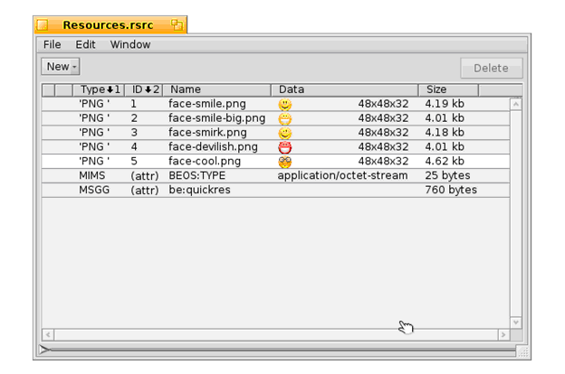

第十九课
======================

.. contents::

Interface 套件是我们最后几节中主要功能的来源，但是这一节我们做些拓展。这一节将要讲述的内容是转换套件和部分的存储套件。

转换套件(Translation Kit)
------------------------------------

在古老的 Be 历史上，转换套件由 Jon Watte 所编写，它和语言翻译没有任何关系。相反，它用于将图像和文本从一种格式转换为其他格式。这通常相当于从磁盘载入位图图像。 **位图(Bitmap)** 是一种图像类型，它将其图片信息存储为点的集合。 **矢量图像(Vector images)**  则将其信息存储为一系列的绘图指令。这就是照片和动态图像的区别，因为前者是位图图像。

转换套件使用一种特别的方式来载入图像：它的功能通过附加组件（add-on）进行定义和扩展。附加组件是在 Haiku 的许多地方都用到的强大的编程方法。在这里，它们之所以强大是因为添加一个特殊图像格式的 转换器(Translator)之后，每个使用了转换套件的 Haiku 程序都可以马上获得对这种格式的支持。它要优于现在任何操作系统中用到的处理方式。这也方便写出更加简单的图像处理代码。

在我们的程序中，转换套件有两种不同的使用方法。在给定环境中，需要根据我们的需求来决定使用何种方法。简单的方法用于载入位图图像。而较为复杂的方法在我们同时载入和保存或者我们使用转换套件处理位图以外的其他图像时才有需要。这里我们将使用简单的方法，具体细节如下所述。

程序资源
------------------------------------

应用资源是一种将和程序相关的数据打包到其可执行文件的方式。它是一种较为便利的方式，可以保证您的程序中的图片总是可用，并且不会被用户的神奇膏药或其他东西所覆盖。您的程序的图标就是一种资源。GUI 中所用到的图像也应该以这种方式保存。确切的说，其他程序信息，如所要处理的文件类型和启动特征，也要保存为程序的资源。

Haiku 中有许多工具可用于添加，删除，和编辑程序资源。QuickRes 是 Be 提供的原始标准的程序资源编辑器。不便的是，它并不开源，无法用于 GCC4 版本的 Haiku 安装。Haiku 开发了一个资源编辑器，称为 ResEdit，但在本文编写时，它还仅能够满足基本使用。rc（资源编译器）是一个命令行工具，用于在文本文件和二进制文件之间进行互相转换。它有利于资源文件和源控制系统（如 CVS）的兼容，而后者不能够很好的处理二进制文件。xres 是一个命令行工具，用于对资源进行操作。您可以使用自己喜欢的工具，但是在本节中，我们重点关注 QuickRes，因为它运行的很好，并且在时机成熟后，从 QuickRes 向 ResEdit 的转移相对不会很困难。

尽管能够在编辑器中打开可执行文件，直接编辑程序的资源，但这是不常用的向应用程序中添加资源的方式，也是不推荐的。资源通常放置在资源文件中，在编译时添加到可执行文件。资源文件有两种格式：后缀为 .rsrc 的二进制格式和后缀为 .rdef 的文本文件格式。Paladin 同时支持这两种格式，并且会自动将所有属于您的项目的资源文件绑定到您的应用。

项目：Emo
------------------------------------

接下来我们将要在一个小的项目 “Emo” 中学习如何使用这两种程序资源和转换套件。它从程序资源中载入一些图像，并且每次显示其中之一，当用户点击它们时将修改图片。资源可以在 19Emo.zip 中找出。为了节省空间，只有这节课中涉及到的部分代码才会在下面打印。

首先，我们从项目的资源文件开始：Resources.rsrc。创建资源文件并不苦难，但是让我们看一下这个文件在 QuickRes 中打开后的布局。

每个图片在文件中都有其对应的条目，其中显示了其类型，资源 ID，名称，大小，以及最小化预览。添加资源文件，只需要将它们从 Tracker 拖拽至 QuickRes 窗口。删除只需要双击文件即可，这些都很容易。资源 ID 是非常随意的，但是对于其中保存的同种数据格式文件，它们都必须是唯一的。每个资源的名称是可选的，但是建议添加。您可以为资源文件添加任何您喜欢的数据类型，并且使用您自己的资源类型代码，但是尽量保持它们的小巧，因为它们对可执行体的尺寸有直接的影响。较大的资源文件应该保存于它们独立的文件。下面我们来看代码。

令人惊奇的是，Haiku 的 API 并没有仅显示图像的视图，但是幸好，对于我们来说，创建一个并不困难。首先，我们来看头文件:

PictureView.h
''''''''''''''''''''''''''''''''''''

.. code-block:: cpp

    #ifndef 	PICTUREVIEW_H
    #define 	PICTUREVIEW_H
     
    #include <Message.h>
    #include <Bitmap.h>
    #include <String.h>
    #include <View.h>
     
    class PictureView : public BView
    {
    public:
    			PictureView(void);
    			~PictureView(void);
     
    	void		Draw(BRect rect);
    	void		MouseUp(BPoint pt);
     
    private:
    	BBitmap		*fBitmaps[5];
    	int8		fBitmapIndex;
    };
    #endif

上面的代码看起来并无特殊之处。但并不如您所见。这个类有一个五个 BBitmap 指针的数组和一个我们用以指向当前位图的索引。在 PictureView 的主代码中，它可能有那么一点复杂：

PictureView.cpp
''''''''''''''''''''''''''''''''''''

.. code-block:: cpp

    #include "PictureView.h"
    #include <TranslationUtils.h>
    #include <TranslatorFormats.h>
     
    // 下面的类是我们自己的特殊控制。它从应用程序资源中载入五个
    // 图像，然后将其放入数组。载入之后，它调整尺寸以便符合第一
    // 位图。因为它们的尺寸都一样，我们可以这么假定，任何出现的
    // 问题都可能是我们的错误。多数人并不编辑程序资源，如果他们
    // 去做了，就让他们享受自己行为的代价。>:D
    PictureView::PictureView(void)
    	:	BView(BRect(0,0,100,100), "picview", B_FOLLOW_LEFT | B_FOLLOW_TOP,
    			B_WILL_DRAW);
     
    fBitmapIndex(0);
    {
    	// 使用循环载入图片。有5个不同的B转换Utils::GetBitmap
    	// 版本。下面是两个用于从程序资源载入图像的方法之一。
    	for (int8 i = 1; i <= 5; i++)
    	{
    		BBitmap *smiley = BTranslationUtils::GetBitmap(B_PNG_FORMAT, i);
    		fBitmaps[i - 1] = (smiley && smiley->IsValid()) ? smiley : NULL;
    	}
     
    	if (fBitmaps[0] && fBitmaps[0]->IsValid())
    		ResizeTo(fBitmaps[0]->Bounds().Width();
     
    	fBitmaps[0]->Bounds().Height());
    }
     
    PictureView::~PictureView(void)
    {
    }
     
    // 当要求在屏幕上自行绘制时，BView的Draw()函数才要调用。
    // 这也是仅有的几个需要调用BView的绘图命令的地方。
    void
    PictureView::Draw(BRect rect)
    {
    	// 出于性能原因，在默认的绘图模式下将忽略透明度值，
    	// 因此我们需要修改绘图模式以利用透明度信息。
    	SetDrawingMode(B_OP_ALPHA);
     
    	// 设置BView的前景颜色为白色。
    	SetHighColor(255,255,255);
     
    	// 填充BView区域为白色。和多数BView绘图命令相似，最后
    	// 的参数是所使用的颜色，默认为深色。其它的颜色选择为
    	// B_SOLID_LOW和B_MIXED_COLORS，前者使用背景颜色，
    	// 后者则混用深色和浅色B_MIXED_COLORS。
    	FillRect(Bounds());
     
    	// 在屏幕上绘制当前位图图像。
    	if (fBitmaps[fBitmapIndex])
    		DrawBitmap(fBitmaps[fBitmapIndex]);
     
    	// 设置前景颜色为黑色。
    	SetHighColor(0,0,0);
     
    	// 在视图外绘制黑色边框
    	StrokeRect(Bounds());
    }
     
    // 鼠标处理有点有趣。BView有三个函数用于鼠标处理：
    // MouseDown()，当鼠标位于视图上，用户点击鼠标按键时，它
    // 将被调用；MouseUp()，当鼠标位于视图上，用户释放鼠标按
    // 键时，它将会被调用；以及MouseMoved()，当鼠标位于视图上
    // 当鼠标改变位置时，它将被调用。这给您，开发者提供了很多
    // 的视图控制以反馈任何的鼠标事件。
    void
    PictureView::MouseUp(BPoint pt)
    {
    	// 切换为数组中的下一个图像，如果位于
    	// 末尾，则切换到其首个图像。
    	if (fBitmapIndex == sizeof(*fBitmaps))
    	{
    		fBitmapIndex = 0;
    	}
    	else
    	{
    		fBitmapIndex++;
    	}
    	// 因为我们修改了图片，强制重绘整个视图。
    	Invalidate();
    }

上面的这个类完成了这个应用的所有真正任务，包括处理鼠标点击和显示适当的图像。MainWindow.cpp 中的代码注释创建了一个背景视图和一个 PictureView 实例。

这个项目最大的亮点就是调用了BTranslationUtils::GetBitmap()。在这里载入 PNG 文件和 JPEG 文件的唯一不同就是不同的类型标识符 — 无需了解如何读取 JPEG 文件。所有的重任都已完成了。哦呜！

深入理解
------------------------------------

根据现在您所了解的内容，您还有很多东西可以去做。相比于编写 C++ 来说，了解 API 及其使用方法也很重要。

试着了解如何使用 BView 的 Pulse() 函数使其每秒自动修改位图图像。查阅 BeBook 中相关章节，了解其具体细节，但是您需要设置发送给 BView 构造函数的标志为 B_WILL_DRAW | B_PULSE_NEEDED 以便使用 Pulse() 函数。

需要记住的内容
------------------------------------

BTranslationUtils
''''''''''''''''''''''''''''''''''''

* GetBitmap(const char *name, BTranslatorRoster = NULL) - 在路径中查找文件，并且如果未发现，则查找命名为 name 的资源。如果有多个同名的资源，则返回首个资源。
* GetBipmap(uint32 type, int32 id, BTranslatorRoster = NULL) - 返回由 type 和 id 标识的资源所包含的图像。
* GetBitmap(uint32 type, const char *name, BTranslatorRoster = NULL) - 返回由 type 和 name 标识的资源所包含的图像。

