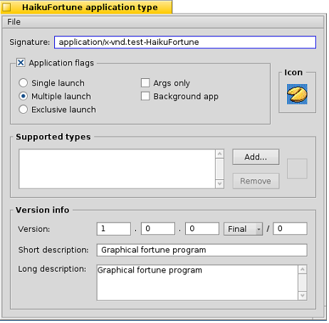

第二十三课
======================

完成一个程序不仅仅是写了代码，然后让其可以运行。我们的 fortune 程序仍然需要一个图标和一些其他的加工处理。

调整资源
------------------------------------

我们接下来的任务是为我们的程序进行加工处理，而此项工作中要做的就是整理程序资源。这些资源保存在分散的文件之中，在程序完成编译之后打包到我们的程序中。那么让我们开始为我们的项目添加资源。

1. 在 Paladin 中，如果你希望添加一个新的文本文件，可以从 Project Menu 中选择 Add New File 来完成操作。
2. 输入 Resources.rsrs 作为新文件名，然后点击确定。

通过以上操作，一个新的源文件就添加到了你的项目中。双击文件，使用默认的源文件编辑器打开该文件。

我们所要做的第一件事就是设置程序图标，但是首先需要找出图标的位置。Haiku 有三种可用的图标格式：矢量图标，大图标，和迷你图标。后两者在所有的 BeOS 系统中是标准的格式，分别是 256 色位图的 32 平方像素和 16 平方像素。而矢量图标是专为 Haiku 开发的特殊格式（Haiku Vector Icon Format），使 Haiku 看起来非常舒服，而且占用很少的存储空间。创建 HVIF 图标已经超出了我们本章的介绍范围，所以我们重点放在位图格式。

1. 在 QuickRes 中打开 Resources.rsrc。
2. 把 HaikuFortune16.png 和 Haiku32.png 拖入 QuickRes 窗口，把它们添加到源文件中。
3. 点击 QuickRes 窗口左侧的 New dropdown 菜单，选择图标，它将会创建两个项目：一个用于 ICON 类型，另一个用于 MICN 类型。它们分别用于大图标和迷你图标。
4. 单击 ICON 类型项目，点亮图标。等稍微长的时间 —— 直到 QuickRes 不认为您是在双击 —— 并且点击项目的名字，“New Icon”。如果操作正确，将会出现一个文本框，您可以编辑它的名字。
5. 修改 ICON 项目的名字为 BEOS:L:STD_ICON,然后按下回车结束名字的编辑。顺便提一下，注意这里需要使用大写。
6. 对 MICN 项目执行同样的操作，但是命名为：BEOS:M:STD_ICON。
7. 双击 HaikuFortune32.png，在编辑窗口中打开它。
8. 选择图像，使用 Edit 菜单中的 Select All 和 Copy 命令将其复制到剪贴板。
9. 关闭 HaikuFortune32.png 的窗口，然后双击刚刚创建的 ICON 项目。
10. 
11. 点击 Edit 菜单中的 Paste。源于 HaikuFortune32.png 中的图像数据将会显现在较大网格中。
12. 执行同样的步骤从 HaikuFortune16.png 中拷贝数据至窗口的较小网格中。

一旦您根据这些步骤，并且保存了所作修改到源文件，关闭 QuickRes，然后重新编译您的工程。如果执行的操作都是正确的，您的程序的图标将会成为一个漂亮的蓝色背景下的小 fortune cookie。否则，返回，重新检查您的工作，发现是否有错过的步骤，然后再做出修改。

我们还需要为我们的应用程序设置版本号，署名，启动标签。因此，我们将要使用 FileType Tracker 附件。打开您的工程目录，选择源文件，右键点击，然后从 Add-on 子菜单中选择 FileType。

窗体的一些部分是非常明了的，但是我们最好全部浏览一遍，我们从顶部的应用程序署名（signature）开始。署名应该和我们代码中传递给 BApplication 构造函数的字符相同，但是要除去附加上的引号。虽然在您的程序资源中不对它进行设置，不是什么足以令地球震撼的错误，但是如果您添加了署名，则它应该和传送给 BApplication 的署名相匹配。

Application Flags 部分用于设置一些关于您的程序如何启动的选项。Single launch 模式，它非常常用，但不是默认的行为，装载我们的程序的一份拷贝到内存，然后执行运行。但是在尝试运行第二个程序拷贝时，则什么也不执行，如果它没有被最小化，则将会切换到该程序。然而，如果用户重命名了它的执行文件，然后尝试运行，那么它也将会运行第二份拷贝。Exclusive launch 模式，它将会阻止这种情况，而确保在内存中每次仅有一份程序拷贝在运行。Multiple launch 允许您的程序的多个实例同时在内存中运行。如果您不对 application flags 进行设置，将会设置为默认行为。选中 Args only 复选框则意味着传递给您的程序的消息将只能够通过给定的命令行参数进行。BeOS 类型的消息将不会传递给它。该标志在命令行应用程序中的使用非常广泛。Background app 复选框允许您的程序在后台运行，而在 Deskbar 中没有快捷式。而且该标签特别应用于系统服务组件，例如，Media Server 和 Mail Daemon。

Supported Types 选框和您的程序明确支持的文件类型相关联。例如，如果您在编写一个电子表格应用程序，您可以将它所包含的各种类型的电子表格放置在其中。我们的 Fortune 程序不执行任何与此相关的任务，因此，我们将把它置为空。

Version Info 选框包含了用于控制我们的应用程序版本号的信息。下拉菜单选框用于设置发布版本的质量，例如，Alpha，Beta，Golden master（称为，候选版本），以及 Final。Short description 应该包含您的程序功能的简要描述。而 Long description 区域则应该包含更多的信息，一句或者多句话，但是不应该包含一个短篇小说。

源代码授权
------------------------------------

一旦我们设置了程序的资源，我们应该考虑为我们的源代码选择一个授权。所有的源代码都应给被授权。当然，使用何种授权，这完全取决于它的作者的意愿。在发布您的程序之前，您需要考虑它的发行许可。完成这些将会决定您的程序的发展方向和使用周期。在美国，选择授权许可的失败将会导致应用于您的代码的版权条款的限制。如果您居住在美国以外的地方，则应该检查您所处区域的特定官方规定。

首先，考虑是否您的源代码对其他人可用 —— 闭源或者开源。Haiku 基于开源软件，而且它周围的社区大部分也依照此种方式。除非，您计划最终对您的程序进行收费，否则开源将会是比较好的选择。如果，在将来某些时候，您决定不再对您的程序进行维护，那么其他人可以继续维护和完善您的程序。BeBits software 网站上的许多程序都已经被遗弃了，并且它们的开发无法继续，这都是因为它们的源代码不是开放的，而且开发者都已经没有了。

如果您确实希望使您的程序源代码可以被他人所使用，有许多的开源许可可供使用。下面是一个著名的开源许可的列表，并且都有相关的概括说明：

* MIT – The code can be used pretty much however a person wants so long as the included copyright information is left intact. This is the license under which Haiku is released. It is popular with other BeOS / Haiku developers for their own projects, as well.
* GNU Public License (GPL) – Any public binary distribution of GPL software must also make the sources available. Any code which uses GPL code must also be released under the GPL. This is the most popular license for software for the Linux operating system.
* Lesser GNU Public License (LGPL) – Any public binary distribution must also make the sources available. Any code which directly uses LGPL code must also be released under the LGPL, but if a program merely links against LGPL code, this is not required. In other words, linking against an LGPL library does not require the program that links against it to have the same license.
* Mozilla Public License (MPL) – As per the GPL, but any changes to MPL-licensed code must also be submitted back to the original project.
* Public Domain – The author relinquishes all rights to the code. Literally anything can be done with the code, including removing all copyright information and anything else you could think of. Also, once code is released into the public domain, it cannot be taken back. However, nothing would stop you from using it, improving it, and re-licensing your code.

打包发布程序
------------------------------------

在结束我们的工作之前，有必要介绍一下如何发布我们的程序。有两种方法可用于发布程序：package 文件或者 zip 压缩档。两种方法都有值得说明的好处和缺点。

在这两者之中，package 是比较有效的格式。它们可以利用 BeOS 开发工具 PackageBuilder 进行创建。由于 PackageBuilder 是 BeOS R5 开发工具包的一部分，它们可以自由下载，但是不能够作为其他发行的一部分而再发布。PackageBuilder 已经不再进行开发，而且将无法运行于 non-hybird GCC4 Haiku 环境。虽然，由它创建的包可以在这种环境中安装。它可以把文件安装在计算机中的多个位置。但是其中没有相关的工具，不能够在 Deskbar 中创建链接，符号链接可以和包中的其他文件一样进行创建和安装。由于它更具灵活性，而作为代价的就是包的创建将会需要很多时间。

Zip 压缩档是两者之中最简单和快速的格式。把所有内容打包成它们在应用程序文件中存在的形式，然后运行 Zip-O-Matic Tracker 附件。不幸的是，它把安装应用程序目录和在 Deskbar 中创建符号链接的任务留给了用户。Zip 压缩档推荐用于简单的程序，它们不需要在硬盘的多个位置放置文件。

下一步
------------------------------------

从第一课开始，我们讲解的内容覆盖了很多方面的信息。但是，如果您希望走出初学者的困惑，还需要很多东西需要了解和学习。最好的提高方式就是写代码和学习。您现在了解的内容已经给予了您足够的能力为 Haiku 写出许多不同类型的程序，并且将会给予您方法来学习其他的 Haiku API 和 C++ 编程的其他方面内容。下面这些主题，希望您能够认真的对待：

C++
''''''''''''''''''''''''''''''''''''

* Exceptions
* Templates and the Standard Template Library
* Multiple Inheritance

Usability
''''''''''''''''''''''''''''''''''''

* The Design of Everyday Things, Donald Norman
* The Humane Interface, Jef Raskin

Good Programming
''''''''''''''''''''''''''''''''''''

* Design Patterns: Elements of Reusable Object-Oriented Software, Erich Gamma, Richard Helm, Ralph Johnson, and John Vlissides

Programming for BeOS / Haiku
''''''''''''''''''''''''''''''''''''

* Programming the Be Operating System, Dan Parks Sydow. This is out-of-print but is available from O'Reilly's website as a free PDF.
* The BeOS sample code projects and accompanying articles
* The Be Book. This is the authoritative manual on the BeOS / Haiku API.

